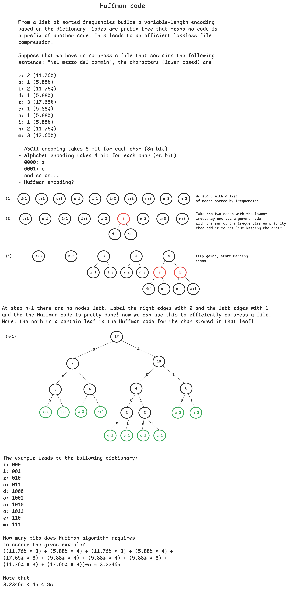

# huffman-encoder

<div align="center">


</div>

Command line application to test Huffman code for lossless file compression.

Huffman code is a type of optimal prefix code.
The process of finding or using such a code is Huffman coding, an algorithm developed by [David A. Huffman](https://en.wikipedia.org/wiki/David_A._Huffman). 
Huffman algorithm is a greedy algorithm that uses a frequency-sorted binary tree and generates "prefix-free codes" namely the bit string representing some particular symbol is never a prefix of the bit string representing any other symbol.

An example of how it works with the message `A_DEAD_DAD_​CEDED_A_BAD_​BABE_A_BEADED_​ABACA_BED`


[credits](https://commons.wikimedia.org/wiki/User:Cmglee)


> [!IMPORTANT]
> This is still a work in progress. The whole decompression has to be added and there is room for performance improvement.

> [!WARNING]
> The cli still supports only `txt` files.

### Installation

```console
git clone https://github.com/micheledinelli/huffman-encoder.git
```

build it with

```console
go build -o huffman
```

### Usage

To list all the available commands use
```console
./huffman --help
```

Along with the source code there is also a file named `divine-comedy-it.txt` which is the divine comedy by Dante Alighieri in Italian in `.txt` format. It can be used to test the Huffman code.

```console
./huffman c divine-comedy-it.txt

// c, compress and encode are aliases
```

`divine-comedy-it.txt` is compressed in `huffman.bin` which is 280KB almost half of the size of the original one (543KB).


The cli also outputs metadata (`huffman.metadata`), the unique encoding for this specific text file in order to be able to decompress it later.