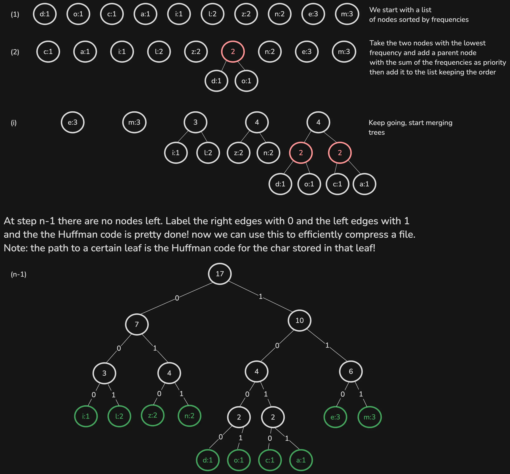
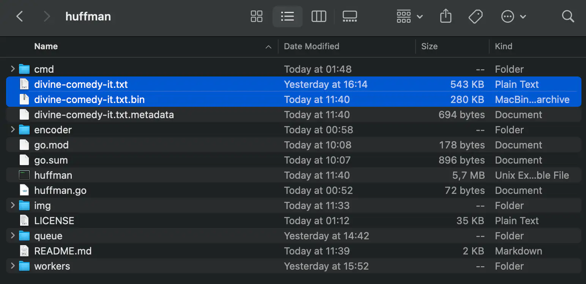

# huffman-encoder

<div align="center">


</div>

Command line application to try Huffman code for lossless file compression.

> [!IMPORTANT]
> This is still a work in progress. The whole decompression has to be added and there is room for performance improvement.
> 
> The cli still supports `txt` files only.


Huffman code is a type of optimal prefix code.
The process of finding or using such a code is Huffman coding, an algorithm developed by [David A. Huffman](https://en.wikipedia.org/wiki/David_A._Huffman). 
Huffman algorithm is a greedy algorithm that uses a frequency-sorted binary tree and generates "prefix-free codes", in other words the bit string representing some particular symbol is never a prefix of the bit string representing any other symbol.

<div align="center">



</div>

### How to try

```console
git clone https://github.com/micheledinelli/huffman-encoder.git
```

```console
go build -o huffman
```

Once built list all the available commands with
```console
./huffman --help
```

Along with the source code there is also a file named `divine-comedy-it.txt` which is the divine comedy by Dante Alighieri in Italian in `.txt` format. It can be used to test the Huffman code.

```console
./huffman c divine-comedy-it.txt

// c, compress and encode are aliases
```

`divine-comedy-it.txt` is compressed in `huffman.bin` which is 280KB almost half of the size of the original one (543KB).

The cli also outputs metadata (`huffman.metadata`), the unique encoding for a specific file in order to be able to decompress it later.